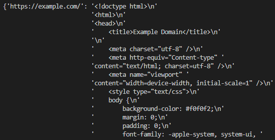

`Freezer` is a basic script that will allow you to save text content of the website to the **Redis** database and vice versa.<br>
It reduces the number of requests sent while prototyping a web scrape to a minimum.



Cached value is held in memory until the end of the day to ensure that you can ping the website once a day:
```python
# expire_time = number of seconds to the next day
self.redis_client.expire(url, expire_time)
```

If you are using [WSL](https://learn.microsoft.com/en-us/windows/wsl/about), you can paste those functions into `$PROFILE` to make your life easier:
```powershell
function redis-start {wsl sudo service redis-server start}
function redis-stop {wsl sudo service redis-server stop}
function redis-status {wsl sudo service redis-server status}
function redis-clear {wsl redis-cli FLUSHALL}
```